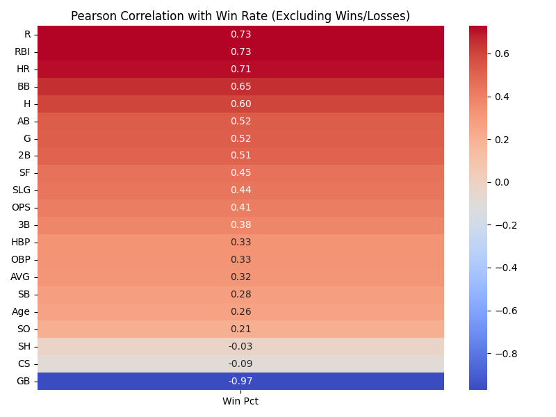
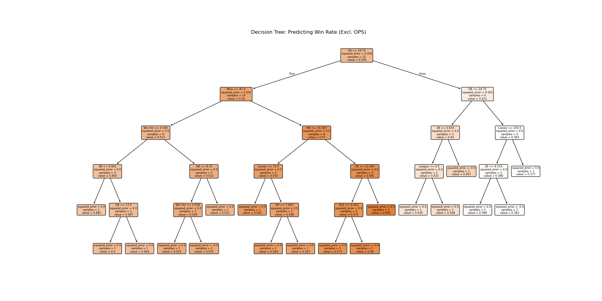

# MLB Report

本專案使用 MLB 球員的表現數據，透過機器學習模型（例如決策樹），預測球隊勝率。

## 內容包含：

- 球員數據處理與加權平均
- 資料合併與清洗
- 熱力圖視覺化
- 決策樹模型預測勝率
- GitHub 與本機同步流程

## 結果展示

## 使用說明

1. 安裝所需套件：`pandas`, `seaborn`, `scikit-learn`, `matplotlib`
2. 執行 `mlbreport.py`
3. 查看 `merged_output.csv` 及 `heatmap.png`
